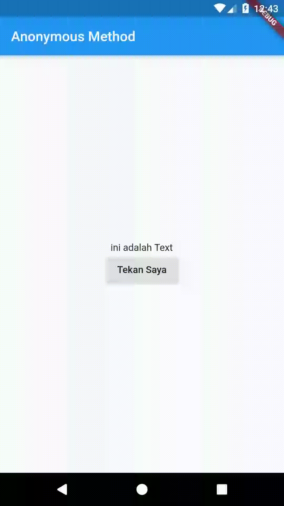

# a8_anonim_method

Belajar anonymous method, method yang tidak memiliki nama, kapan kita menggunakan? ketika kita panggil satu kali saja. Tapi bebas sih, enaknya juga methodnya ditulis namanya, jadi lebih read-able.

