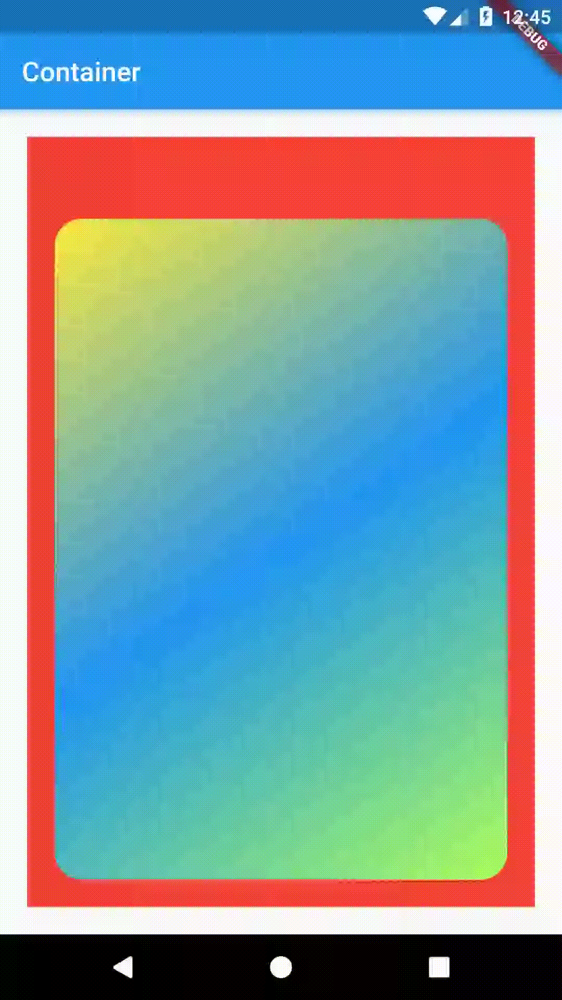

# a6_container

container 

jika punya masalah tentang gradient (karena flutter upgrade), mungking ini bisa membantu [github fluuter issu gradient](https://github.com/flutter/flutter/issues/63908)

cek dlu dengan `flutter doctor -v`, liat paling atas berada channel mana? jika bukan master, balikan ke master dengan cara running this: 

```bash
flutter channel master
flutter clean
```

restart your vs code

